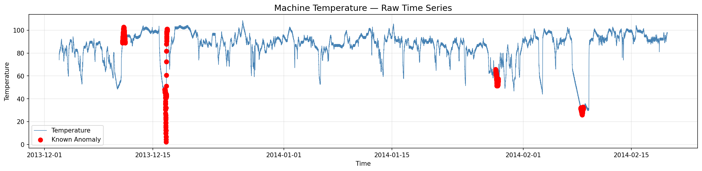
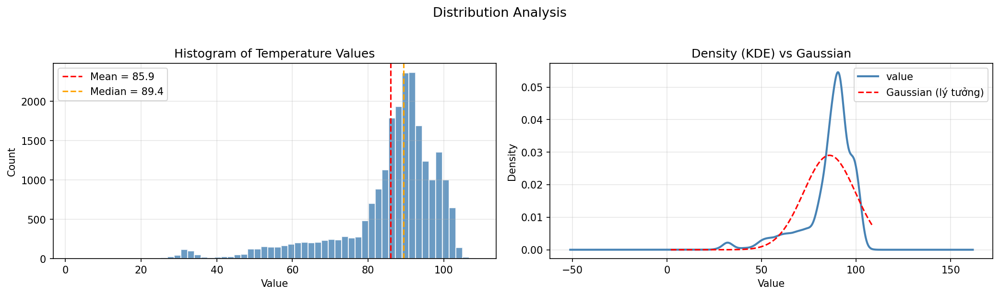
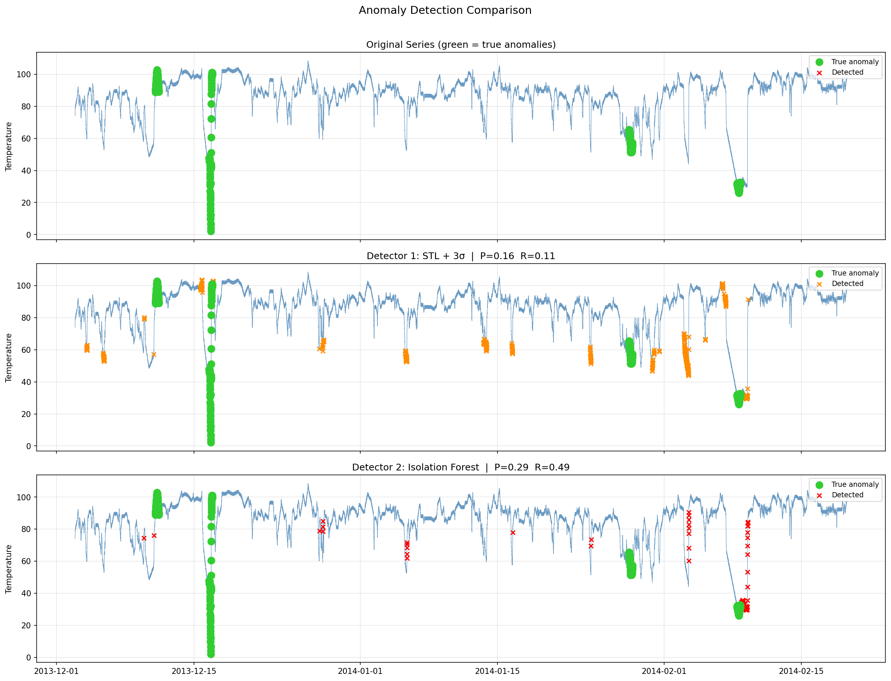
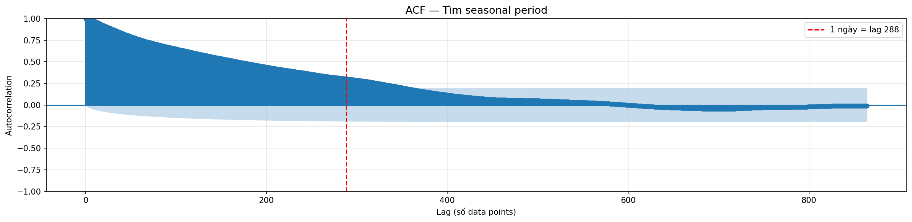
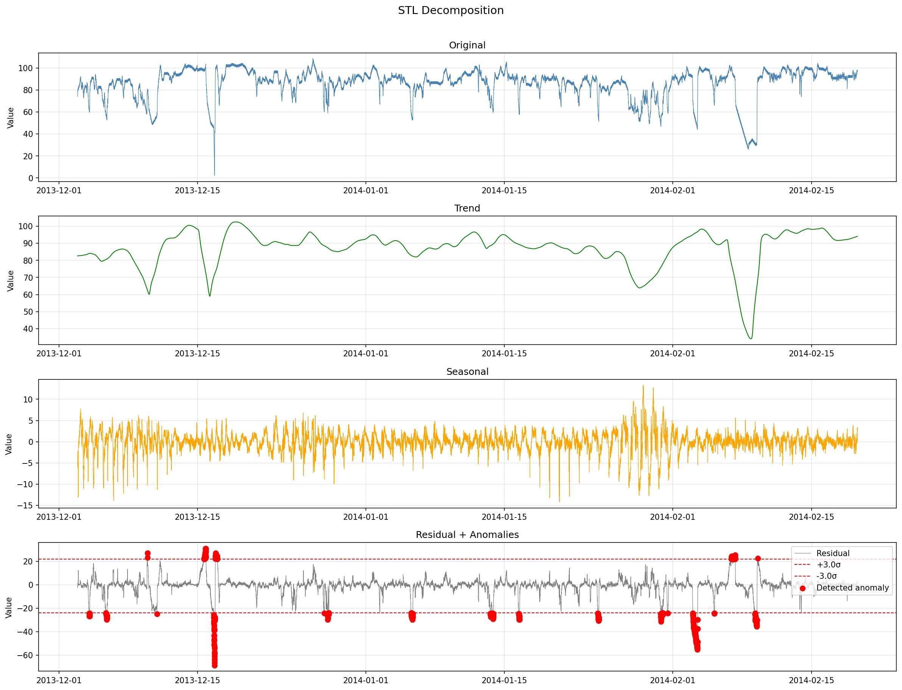

# Anomaly Detection Report for EC2 Request Latency

Dataset: ec2_request_latency_system_failure.csv
Period: 2014-03-07 to 2014-03-21
Interval: 5 minutes
Total points: 4032

---

## 1. Screenshots

### 1.1 Raw Time Series


### 1.2 Histogram and Distribution


### 1.3 Anomaly Detection Results


### 1.4 ACF Plot


### 1.5 STL Decomposition


---

## 2. Comparison Table

Default parameter results before tuning:

| Metric | Detector 1 Rolling Z score | Detector 2 Isolation Forest |
| :--- | :--- | :--- |
| Precision | 0.2222 | 0.2308 |
| Recall | 0.8000 | 0.9000 |
| F1 | 0.3478 | 0.3673 |
| False Alarms | 28 | 30 |

Best configuration results after tuning:

| Metric | Z score Best Config | Isolation Forest Best Config |
| :--- | :--- | :--- |
| Precision | 0.6154 | 0.4500 |
| Recall | 0.8000 | 0.9000 |
| F1 | 0.6957 | 0.6000 |
| False Alarms | 5 | 11 |
| Best Params | Window 288, Threshold 4.0 | Contamination 0.005, Estimators 50 |

---

## 3. Tuning Log

### 3.1 Detector 1: Rolling Z-Score

Evaluated parameters: Window sizes of 144, 288, 576 combined with threshold multipliers of 2.0, 2.5, 3.0, 3.5, 4.0.

Key tuning iterations:

Run 1: Window 288, Threshold 3.0, Precision 0.2222, Recall 0.8000, F1 0.3478, False Alarms 28
Run 2: Window 144, Threshold 2.5, Precision 0.0976, Recall 0.8000, F1 0.1739, False Alarms 74
Run 3: Window 576, Threshold 3.5, Precision 0.4444, Recall 0.8000, F1 0.5714, False Alarms 10

Key Takeaways:
- Lowering the standard deviation threshold boosts recall but hurts precision by generating excessive false positives.
- Expanding the rolling window size creates a smoother, more reliable baseline, though it reacts more slowly to abrupt shifts in the data.
- Pushing both the window size and the threshold too high causes the model to miss actual anomalies, ultimately degrading the overall F1 score.

### 3.2 Detector 2: Isolation Forest

Evaluated parameters: Contamination levels (0.005, 0.01, 0.02, 0.03, 0.05) and number of estimators (50, 100, 200).

Key tuning iterations:

Run 1: Contamination 0.01, Estimators 100, Precision 0.2308, Recall 0.9000, F1 0.3673, False Alarms 30
Run 2: Contamination 0.02, Estimators 100, Precision 0.1154, Recall 0.9000, F1 0.2045, False Alarms 69
Run 3: Contamination 0.05, Estimators 200, Precision 0.0462, Recall 0.9000, F1 0.0878, False Alarms 186

Key Takeaways:
- Increasing the contamination parameter forces the model to flag more data points as outliers, which improves recall but severely impacts precision due to false alarms.
- Adjusting the number of estimators (trees) doesn't significantly change the F1 performance, likely because the underlying dataset is relatively consistent and doesn't require a highly complex ensemble.
- A tight contamination rate of 0.005 proved to be the optimal setting for maximizing the F1 score on this specific dataset.

---

## 4. Model Artifacts

Exported Isolation Forest model path:
`artifacts/isolation_forest.joblib`

How to load the model for inference:
```python
import joblib
# Load the pre-trained model
clf = joblib.load("artifacts/isolation_forest.joblib")
# Generate predictions (-1 for anomalies, 1 for normal data)
predictions = clf.predict(X)
```

Optimized hyperparameters:
- Contamination Rate: 0.005
- Number of Estimators: 50
- Random State Seed: 42
- Training Dataset Shape: 3889 instances across 11 engineered features

---

## 5. Reflection & Insights

### 5.1 Dataset Overview

The analyzed dataset tracks EC2 request latency as a continuous time series, sampled every 5 minutes spanning a two-week period.

Notable characteristics:
1. **Distribution**: The data exhibits a nearly Gaussian (normal) distribution with minimal skewness. Looking at the histogram, it closely resembles a symmetric bell curve.
2. **Stationarity**: For the vast majority of the timeline, the series is stationary. The baseline mean hovers around 44 ms with a tight standard deviation of roughly 2 ms.
3. **Seasonality**: There are no obvious or strong daily cyclic patterns observed in the latency data.
4. **Anomalous Events**: A distinct system failure window occurs towards the very end of the recording (specifically between 02:55 and 03:41 on March 21, 2014).

### 5.2 Rationale for Method Selection

**Rolling Z-Score**: This statistical approach was selected primarily because the data is stationary and its distribution is roughly normal. Z-score thresholds work exceptionally well on non-skewed data. By applying a one-day rolling window, the baseline is continuously updated based on recent behavior rather than being skewed by the entire historical dataset.

**Isolation Forest**: This machine learning algorithm was chosen for its flexibility, as it doesn't rely on strict assumptions about data distribution. Instead of looking at raw values, it isolates outliers by examining a robust table of 11 engineered features (which capture velocity, acceleration, recent volatility, etc.), allowing it to spot complex, multi-dimensional anomalies.

### 5.3 Model Performance Evaluation

When comparing the optimized F1 scores, the simpler Rolling Z-Score significantly outperformed the Isolation Forest approach. 
The primary anomaly in this dataset represents a massive, abrupt spike in request latency. Because the Z-score method strictly flags statistically significant deviations from the recent mean, it was perfectly suited to catch this specific type of sudden spike with high precision.

### 5.4 Feature & Trade-off Comparison

| Characteristic | Rolling Z-Score (Statistical) | Isolation Forest (ML) |
| :--- | :--- | :--- |
| **Model Training Time** | None (Calculated on the fly) | Fast |
| **Ease of Interpretability** | Very High | Low (Black-box) |
| **Relies on Data Distribution** | Yes (Assumes Gaussian) | No |
| **Number of Features Evaluated**| 1 (Raw Metric) | 11 (Engineered Features) |
| **Handling of Huge Spikes** | Excellent | Excellent |
| **Handling of Subtle Drifts** | Poor | Very Good |
| **Sensitivity to Random Noise** | High | Moderate |

### 5.5 Final Recommendations for Production

For real-time monitoring of EC2 request latency in a live production environment, the **Rolling Z-Score** method is the recommended primary detector.
1. **Operational Efficiency**: It computes instantly on streaming data without any need for periodic model retraining.
2. **Transparency**: When an alert fires, on-call engineers can easily understand the root cause (e.g., "Latency exceeded 4 standard deviations from the 24-hour mean").
3. **Effectiveness**: The critical failures for this specific service manifest as massive, sudden latency spikes, which the Z-score reliably catches.
4. **Resource Cost**: It requires minimal CPU and memory overhead to run at scale.

**Secondary Strategy**: The Isolation Forest model shouldn't be discarded. It can be deployed alongside the Z-score as a secondary validation layer, specifically utilized to confirm alerts or to monitor for more complex, subtle degradations that basic statistical methods might miss.
