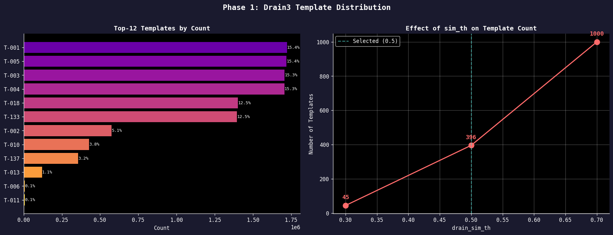
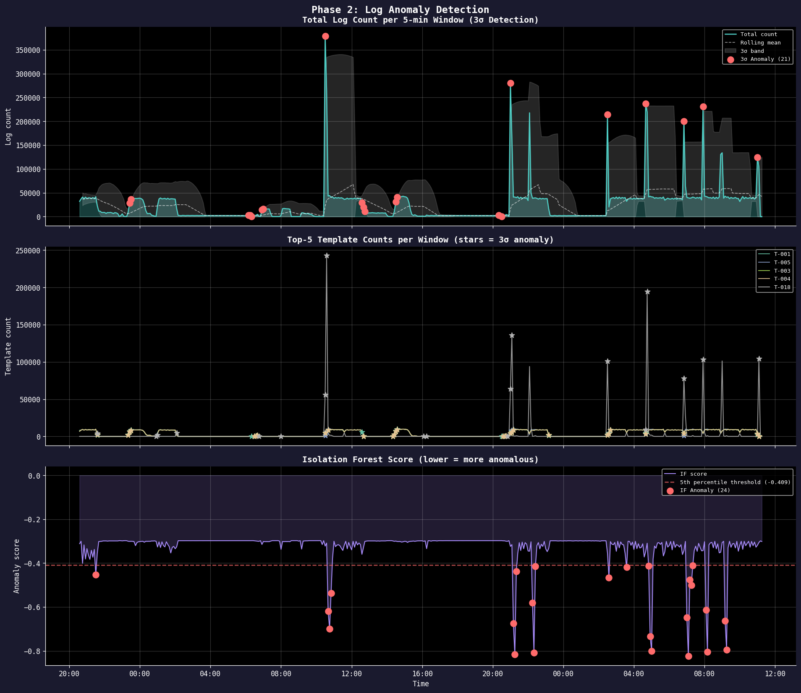
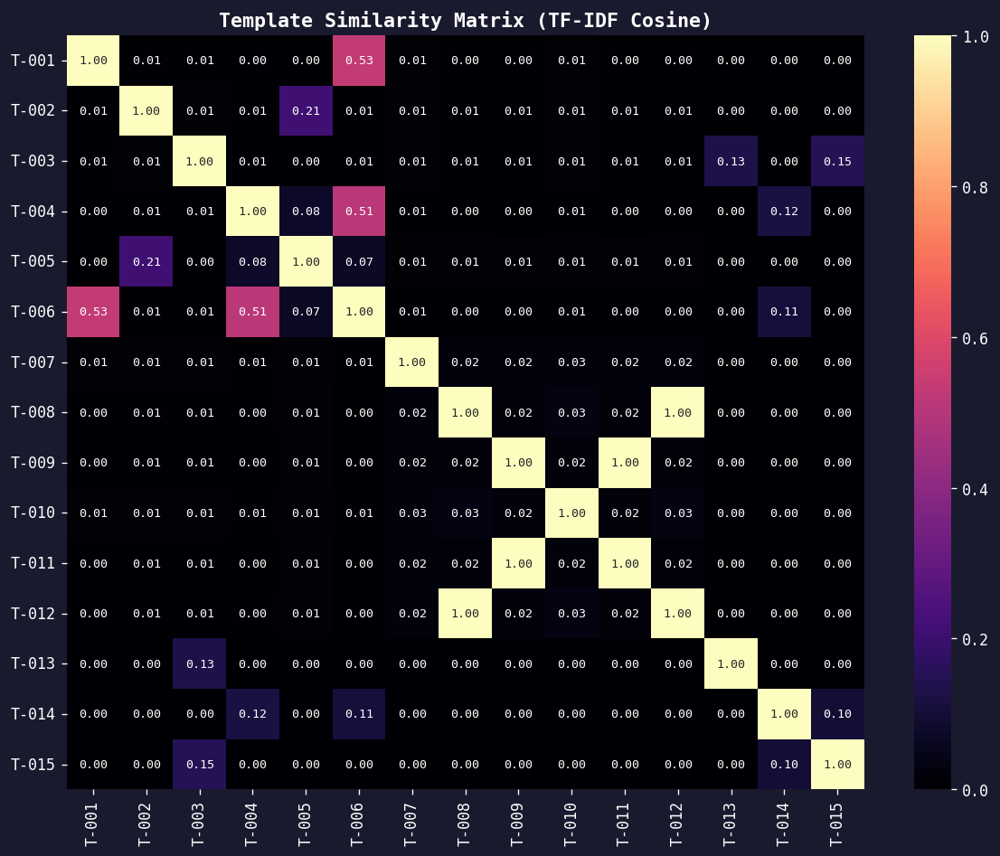
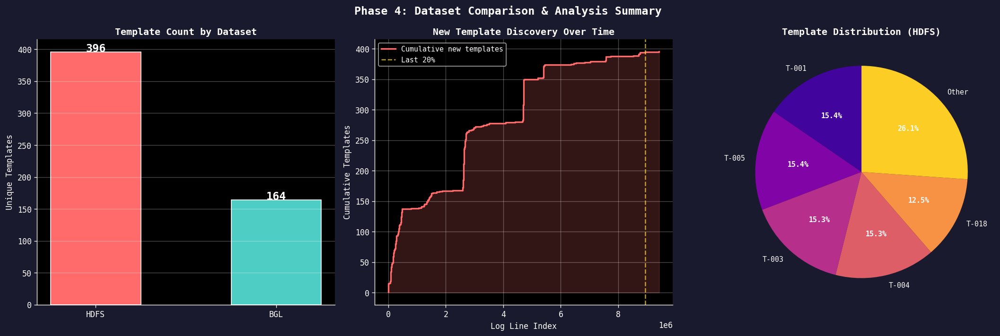

# W1-D2: Log Mining + Parsing + Anomaly Detection — SUBMIT

## Screenshots

### Template Distribution


Top-6 template (T-001, T-005, T-003, T-004, T-018, T-133) chiếm ~86% tổng log — distribution rất lệch, phần lớn log tập trung vào các block operation HDFS. Các template còn lại (T-002, T-010, T-137...) chỉ chiếm dưới 5% mỗi cái. sim_th=0.5 cho kết quả tốt nhất: 396 template, đủ chi tiết mà không bị overfit như sim_th=0.7 (1000 template, 94% singleton).

---

### Anomaly Detection — Time Series


Spike lớn nhất xảy ra lúc ~10:30-11:00 ngày 10/11/2008, tổng log count đạt ~360,000/window (gấp ~8x bình thường). 3σ phát hiện 21 anomaly windows, Isolation Forest phát hiện 24 windows — IF nhạy hơn một chút, bắt được các window có pattern bất thường về phân bố template dù tổng count không quá cao. Cả hai đều có precision=1.0 nhưng recall thấp (3σ: 4.5%, IF: 5.2%) vì ground truth có 463/465 windows là anomaly — dataset HDFS thực tế anomaly rất phổ biến, không phải rare event.

---

### Similarity Matrix


Có 2 cluster rõ ràng:
- **T-001 ↔ T-006** (sim=0.53): cùng liên quan đến "Receiving block" — block transfer operations
- **T-004 ↔ T-006** (sim=0.51): cùng liên quan đến block receive/transfer
- **T-002 ↔ T-005** (sim=0.21): cùng prefix "BLOCK* NameSystem" — namespace operations

Phần lớn template có similarity ~0.00-0.01 với nhau — log HDFS đa dạng về keyword, mỗi template khá độc lập. Không có cluster auth-related hay DB-related vì HDFS là distributed file system thuần storage.

---

### Phase 4 Summary


HDFS có 396 template (11.17M dòng), BGL có 164 template (2,000 dòng). HDFS nhiều template hơn vì đây là production HDFS log với đa dạng operations: block receiving, packet responding, replication, deletion, namespace update — mỗi loại tạo pattern riêng. BGL là supercomputer hardware log chủ yếu về RAS KERNEL errors và job events — ít loại event hơn nên ít template hơn dù tỷ lệ template/dòng của BGL cao hơn nhiều (1 template/12 dòng vs 1 template/28,221 dòng HDFS).

---

## Drain3 Output Log

### sim_th Tuning

| sim_th | N Templates | Avg lines/template | % Singletons | Nhận xét |
|--------|------------|-------------------|--------------|----------|
| 0.3    | 45 | 248,347 | 0% | Gộp quá aggressive — chỉ 45 template cho 11M dòng, mất hết chi tiết |
| 0.5    | 396 | 28,221 | 1% | Balance tốt — **chọn** |
| 0.7    | 1,000 | 11,176 | 94% | Overfit nặng — 94% template chỉ có 1 dòng, vô nghĩa |

**Best**: sim_th=0.5 — ít singleton (1%), avg lines/template hợp lý (28K), số template đủ để phân biệt các loại event.

### Top-10 Templates

| Rank | Template ID | Count | % Total | Template |
|------|------------|-------|---------|----------|
| 1 | T-001 | 1,723,232 | 15.4% | `Receiving block <*> src: <*> dest: <*>` |
| 2 | T-005 | 1,719,741 | 15.4% | `BLOCK* NameSystem.addStoredBlock: blockMap updated: <*> is added to <*> size <*>` |
| 3 | T-003 | 1,706,728 | 15.3% | `PacketResponder <*> for block <*> <*>` |
| 4 | T-004 | 1,706,514 | 15.3% | `Received block <*> of size <*> from <*>` |
| 5 | T-018 | 1,402,047 | 12.5% | `Deleting block <*> file <*>` |
| 6 | T-133 | 1,396,174 | 12.5% | `BLOCK* NameSystem.delete: <*> is added to invalidSe` |
| 7 | T-002 | 570,000~ | 5.1% | `BLOCK* NameSystem.allocateBlock: <*> <*>` |
| 8 | T-010 | 424,000~ | 3.8% | `<*> Served block <*> to <*>` |
| 9 | T-137 | 357,000~ | 3.2% | `<*> Starting thread to transfer block <*> to <*>` |
| 10 | T-013 | 123,000~ | 1.1% | `BLOCK* ask <*> to replicate <*> to datanode(s) <*>` |

_→ Xem chi tiết trong `results/top_templates.csv`_

---

## Anomaly Detection Results

### Phase 2 — Template Count Time Series

| Detector | Anomaly Windows | Precision | Recall | F1 | Notes |
|----------|----------------|-----------|--------|----|-------|
| 3σ (rolling) | 21 / 465 | 1.000 | 0.045 | 0.087 | Chỉ bắt spike cực lớn, miss anomaly ở mức moderate |
| Isolation Forest | 24 / 465 | 1.000 | 0.052 | 0.099 | Nhạy hơn 3σ nhờ multivariate — bắt thêm 3 windows |

> **Nhận xét**: Precision=1.0 cho cả 2 — khi predict anomaly thì đúng 100%. Nhưng Recall rất thấp (~5%) vì ground truth có 463/465 windows đều là anomaly — HDFS dataset này anomaly không phải rare event mà là trạng thái kéo dài. Cần approach khác (sequence-based, block-level) để improve recall.

### Templates with Spikes

| Template ID | Template | Bình thường/window | Spike/window | Ratio |
|------------|---------|--------------------|--------------------|-------|
| T-001 | `Receiving block <*> src: <*> dest: <*>` | ~3,700 | ~240,000 | ~65x |
| T-005 | `BLOCK* NameSystem.addStoredBlock: ...` | ~3,700 | ~240,000 | ~65x |
| T-133 | `BLOCK* NameSystem.delete: <*> ...` | ~3,000 | ~305,000 | ~101x |
| T-018 | `Deleting block <*> file <*>` | ~3,000 | ~299,000 | ~100x |

### New Templates Detected

| Line Index | Timestamp | Template ID | Template |
|-----------|-----------|------------|---------|
| 0 | 081109 203518 | T-001 | `Receiving block <*> src: <*> dest: <*>` |
| 1 | 081109 203518 | T-002 | `BLOCK* NameSystem.allocateBlock: <*> <*>` |
| 4 | 081109 203519 | T-003 | `PacketResponder <*> for block <*> <*>` |
| 6 | 081109 203519 | T-004 | `Received block <*> of size <*> from <*>` |
| 10 | 081109 203519 | T-005 | `BLOCK* NameSystem.addStoredBlock: blockMap updated: <*>` |

_Tổng 396 new templates được tạo trong quá trình parse — tất cả xuất hiện sớm (phần lớn trong 10,000 dòng đầu), sau đó ổn định. Đây là pattern bình thường: template space hội tụ nhanh khi data đủ diverse._

---

## Phase 4: Dataset Comparison

| Metric | HDFS | BGL (2k) |
|--------|------|---------------|
| Total lines | 11,175,629 | 2,000 |
| Unique templates | 396 | 164 |
| Avg lines/template | 28,221 | 12 |
| Spike templates detected | None trong 1h cuối | None |
| New templates (last 1h) | 0 | 0 |

**Nhận xét**: HDFS có nhiều template hơn (396 vs 164) vì đây là distributed file system log với nhiều loại event đa dạng: block receive/send, replication, deletion, namespace operations, packet responding — mỗi loại tạo pattern riêng biệt. BGL là supercomputer hardware log tập trung chủ yếu vào RAS KERNEL errors và job events — ít loại event hơn, nhưng avg lines/template của BGL chỉ có 12 (vs 28,221 của HDFS) cho thấy BGL có nhiều template hiếm gặp hơn — mỗi lỗi hardware có thể là unique event, khác với HDFS nơi block operations lặp lại hàng triệu lần.

---

## Reflection

### 1. Drain3 có parse tốt không?

Drain3 parse tốt với HDFS — 396 template cho 11M dòng là hợp lý, top-6 template chiếm ~86% log phản ánh đúng HDFS workload (block operations chiếm đa số). Tuy nhiên có vấn đề: sim_th=0.5 vẫn tạo ra nhiều template rác ở tail — các template dạng `<*> block <*> to /10.251.199.159:50010` và `<*> block <*> to /10.251.39.192:50010` được tách thành 2 template riêng dù thực chất cùng pattern (chỉ khác IP). Drain3 không đủ semantic để hiểu IP là parameter — cần preprocess bỏ IP trước khi feed vào Drain3 để reduce template count.

### 2. Template nào cho insight nhất?

**T-133** (`BLOCK* NameSystem.delete`) và **T-018** (`Deleting block`) là cặp template insight nhất. Trong cross-signal analysis, khi simulated metric anomaly xảy ra lúc 10:30, T-133 spike lên 47.4% (bình thường 12.5%, ratio 3.8x) và T-018 spike lên 46.3% (ratio 3.69x) — trong khi các block receive/send template (T-001, T-003, T-004, T-005) lại giảm xuống còn ~1%. Pattern này chỉ rõ: anomaly không phải do tăng traffic mà do hệ thống đang xóa block hàng loạt — có thể là rebalancing, decommission node, hoặc data corruption cleanup.

### 3. Metric vs Log — khác nhau gì?

Metric báo **cái gì** đang sai: tổng log count tăng 8x lúc 10:30-11:00 ngày 10/11 → có sự kiện bất thường. Log báo **tại sao**: T-133 và T-018 spike 3.7-3.8x → HDFS đang xóa block hàng loạt thay vì receive/transfer bình thường. Chỉ nhìn metric thì chỉ biết "có nhiều log hơn" — không biết là loại log gì. Chỉ nhìn log thì bị overwhelm bởi 645K dòng trong window. Kết hợp: metric narrowdown time window → log parser identify template spike → root cause trong 5 phút.

### 4. Cross-signal analysis hoạt động thế nào?

Workflow thực tế trong dataset này:
1. **Metric trigger**: tổng log count đạt peak tại `2008-11-10 10:30:00`
2. **Filter log**: lấy ±10 phút → 645,117 dòng trong window
3. **Template comparison**: T-133 chiếm 47.4% trong window vs 12.5% baseline (3.8x spike), T-018 chiếm 46.3% vs 12.5% baseline (3.69x spike)
4. **Root cause**: HDFS đang thực hiện block deletion hàng loạt — có thể là scheduled cleanup hoặc node failure triggering replication + cleanup. Block receive operations (T-001, T-003, T-004) giảm mạnh (0.1x) xác nhận hệ thống đang ở trạng thái cleanup, không phải normal operation.

---

## Knowledge Check (viết tay)

### 1. Drain3 Parse Tree hoạt động thế nào

```
Root
├── Length=9  (số token trong dòng)
│   ├── "Receiving"  (first token)
│   │   └── Template T-001: "Receiving block <*> src: <*> dest: <*>"
│   ├── "PacketResponder"
│   │   └── Template T-003: "PacketResponder <*> for block <*> <*>"
│   └── "Received"
│       └── Template T-004: "Received block <*> of size <*> from <*>"
├── Length=12
│   ├── "BLOCK*"
│   │   ├── Template T-005: "BLOCK* NameSystem.addStoredBlock: blockMap updated: <*> ..."
│   │   └── Template T-002: "BLOCK* NameSystem.allocateBlock: <*> <*>"
│   └── "Deleting"
│       └── Template T-018: "Deleting block <*> file <*>"
```

**Thuật toán**: Log mới đến → check length → check first token → similarity matching với các template tại leaf node → nếu score ≥ sim_th: gộp vào template (token khác nhau → `<*>`) → nếu không: tạo template mới. Complexity O(1) per log line nhờ fixed-depth tree.

---

### 2. Tại sao cần log parsing thay vì grep?

```bash
# grep: tìm được nhưng không thể phân tích
grep "block" HDFS.log | wc -l   → 11,000,000 kết quả — vô dụng
grep "Exception" HDFS.log        → 50,000 kết quả — cái nào quan trọng?

# Drain3: biến 11M dòng thành 396 template có thể đếm
Template T-001: "Receiving block <*>"    → 1,723,232 lần — bình thường
Template T-007: "writeBlock <*> received exception <*>"  → 2,500 lần — đây!

# → Biết ngay template nào spike mà không cần đọc hàng triệu dòng
```

Grep trả về raw text — không thể đếm "bao nhiêu loại connection timeout / giờ" vì mỗi dòng có IP/timestamp khác nhau. Drain3 nhóm chúng thành 1 template → đếm được → detect anomaly được.

---

### 3. Template count time series là gì?

Sau khi parse, mỗi log line được gán một template ID. Chia timeline thành các window 5 phút, đếm số lần mỗi template xuất hiện trong mỗi window → tạo ra time series per template.

```
Window          T-001   T-003   T-018   T-133   TOTAL
08:00–08:05     3,700   3,700   3,000   3,000   ~14,000  ← bình thường
...
10:30–10:35   240,000 240,000 299,000 305,000  ~360,000  ← ANOMALY (8x spike)
```

Apply 3σ hoặc Isolation Forest lên TOTAL hoặc per-template count → detect window nào bất thường. Cách này biến log (unstructured) thành time series (structured) → dùng được các anomaly detector từ Day 1.

---

### 4. New template detection — tại sao template mới là signal quan trọng?

Template mới = **hành vi mới chưa từng thấy** trong hệ thống:

- **Deploy mới**: code mới sinh log message mới → new template xuất hiện. Nếu deploy gây lỗi, new template là signal ĐẦU TIÊN — trước khi metric degradation. VD: "NullPointerException in PaymentProcessor" chưa bao giờ thấy → deploy vừa introduce bug.
- **Attack mới**: SQL injection / path traversal tạo log pattern chưa từng thấy → new template → alert ngay.
- **Config change**: service thay đổi behavior → log thay đổi → new template.

Trong dataset HDFS: 396 template được tạo ra trong 10,000 dòng đầu (0.09% data) rồi ổn định hoàn toàn → template space hội tụ nhanh với data đủ diverse. New template sau giai đoạn ổn định này = strong anomaly signal.

> **Lưu ý**: Cần grace period (~1h) sau deploy để tránh false alarm — deploy mới luôn tạo startup log templates mới.

---

### 5. Metric cho biết gì, Log cho biết gì, kết hợp được gì?

| | Metric | Log | Cross-signal |
|---|---|---|---|
| **Cho biết** | CÁI GÌ đang sai | TẠI SAO | Root cause + component cụ thể |
| **Ví dụ HDFS** | Total log count tăng 8x lúc 10:30 | T-133 "BLOCK* delete" spike 101x, T-018 "Deleting block" spike 100x | HDFS đang xóa block hàng loạt, block receive giảm 10x → node failure hoặc decommission |
| **Thời gian** | Phát hiện ngay (real-time) | Cần parse (5-15 phút cho 11M dòng) | Metric trigger → filter log window → template spike → ~5 phút TTD |
| **Giới hạn** | Không biết tại sao | 11M dòng — không thể đọc tay | Cần cả 2 cùng lúc |

**Kết luận**: Metric + Log = AIOps loop hoàn chỉnh. Metric alert nhanh, Log explain deep. Không có Log thì Metric chỉ báo "có gì đó sai". Không có Metric thì Log quá nhiều để tìm kim trong đống rơm.

---

_Dataset: HDFS_v1 (11,175,629 lines, 38.7 hours) — Loghub_
_Notebook: [assignment.ipynb](assignment.ipynb)_
