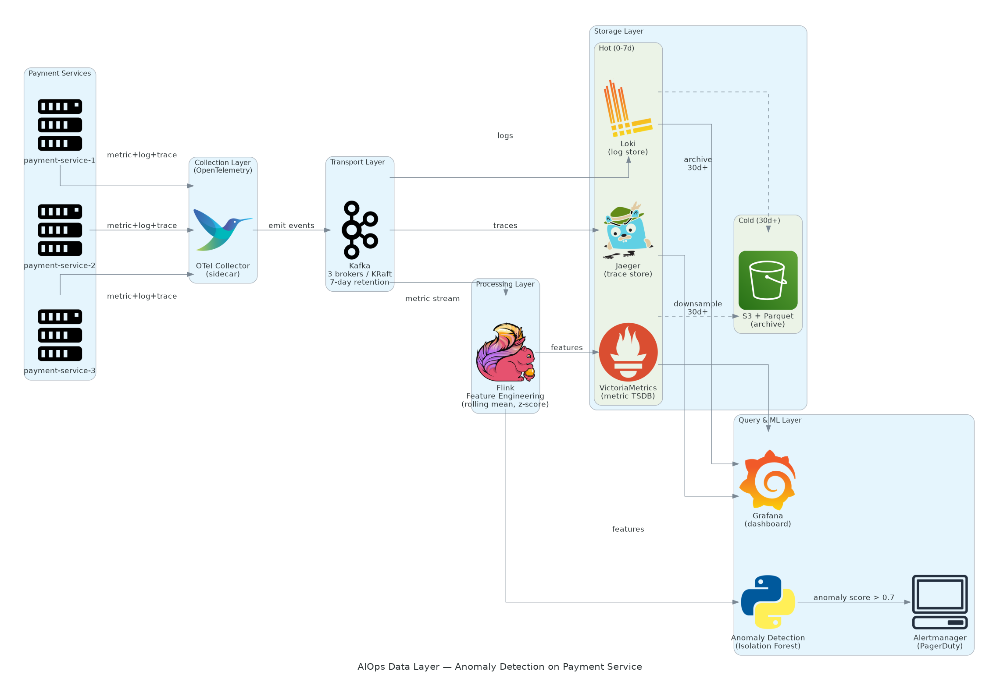
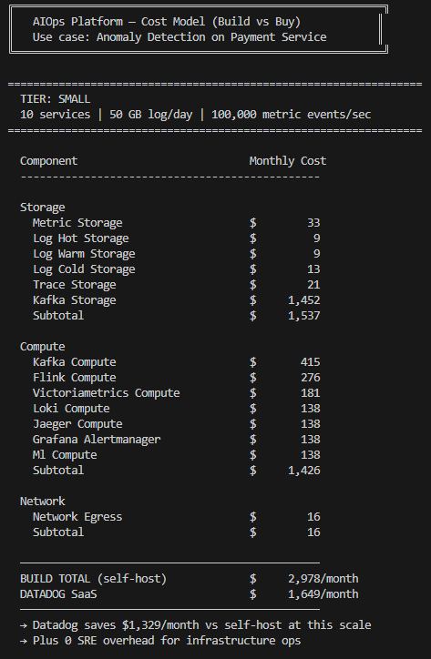
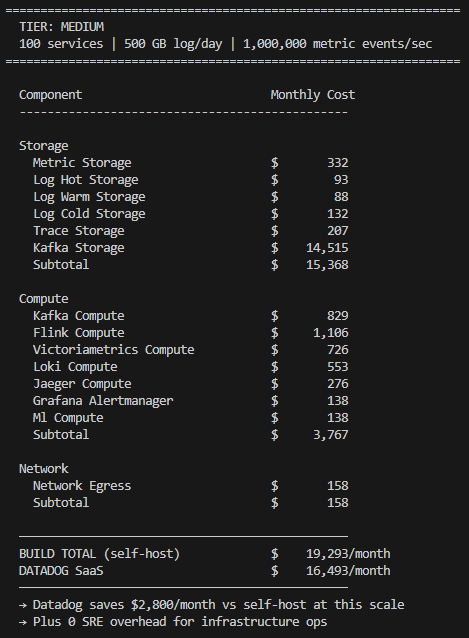
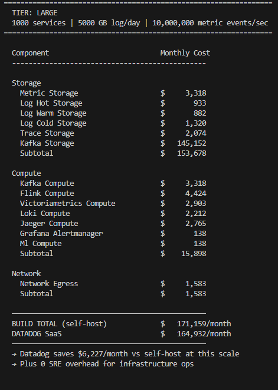
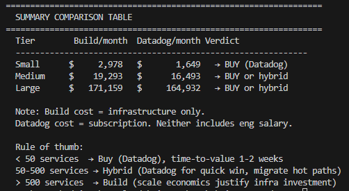

# W1-D3 Submission — Data Layer Architecture + Observability Pipeline

**Use case:** Anomaly Detection on Payment Service  
**Date:** 2024-01-15

---

## Architecture Diagram



**Tool selection:**
| Layer | Tool | Lý do |
|-------|------|-------|
| Collection | OTel SDK + Collector | Vendor-neutral, 1 SDK cho 3 pillars |
| Transport | Kafka (KRaft) | Zero data loss, replay, multi-consumer cho ML |
| Stream Processing | Flink | Real-time feature engineering |
| Metric Storage | VictoriaMetrics | 10x cheaper + better scale vs Prometheus |
| Log Storage | Loki | 10x cheaper vs Elasticsearch |
| Trace Storage | Jaeger | Open-source, CNCF, tail-based sampling 1% |
| Dashboard | Grafana | Unified view metric + log + trace |

---

## Cost Estimate (từ `cost_model.py`)

### Tier: Small


### Tier: Medium


### Tier: Large


### Summary Comparison


### Full Text Output

```
==============================================================
   AIOps Platform -- Cost Model (Build vs Buy)
   Use case: Anomaly Detection on Payment Service
==============================================================

=================================================================
  TIER: SMALL
  10 services | 50 GB log/day | 100,000 metric events/sec
=================================================================

  Component                           Monthly Cost
  -----------------------------------------------

  Storage
    Metric Storage                    $        33
    Log Hot Storage                   $         9
    Log Warm Storage                  $         9
    Log Cold Storage                  $        13
    Trace Storage                     $        21
    Kafka Storage                     $     1,452
    Subtotal                          $     1,537

  Compute
    Kafka Compute                     $       415
    Flink Compute                     $       276
    Victoriametrics Compute           $       181
    Loki Compute                      $       138
    Jaeger Compute                    $       138
    Grafana Alertmanager              $       138
    Ml Compute                        $       138
    Subtotal                          $     1,426

  Network
    Network Egress                    $        16
    Subtotal                          $        16

  -----------------------------------------------
  BUILD TOTAL (self-host)             $     2,978/month
  DATADOG SaaS                        $     1,649/month
  -----------------------------------------------
  => Datadog saves $1,329/month vs self-host at this scale
  => Plus 0 SRE overhead for infrastructure ops

=================================================================
  TIER: MEDIUM
  100 services | 500 GB log/day | 1,000,000 metric events/sec
=================================================================

  Component                           Monthly Cost
  -----------------------------------------------

  Storage
    Metric Storage                    $       332
    Log Hot Storage                   $        93
    Log Warm Storage                  $        88
    Log Cold Storage                  $       132
    Trace Storage                     $       207
    Kafka Storage                     $    14,515
    Subtotal                          $    15,368

  Compute
    Kafka Compute                     $       829
    Flink Compute                     $     1,106
    Victoriametrics Compute           $       726
    Loki Compute                      $       553
    Jaeger Compute                    $       276
    Grafana Alertmanager              $       138
    Ml Compute                        $       138
    Subtotal                          $     3,767

  Network
    Network Egress                    $       158
    Subtotal                          $       158

  -----------------------------------------------
  BUILD TOTAL (self-host)             $    19,293/month
  DATADOG SaaS                        $    16,493/month
  -----------------------------------------------
  => Datadog saves $2,800/month vs self-host at this scale
  => Plus 0 SRE overhead for infrastructure ops

=================================================================
  TIER: LARGE
  1000 services | 5000 GB log/day | 10,000,000 metric events/sec
=================================================================

  Component                           Monthly Cost
  -----------------------------------------------

  Storage
    Metric Storage                    $     3,318
    Log Hot Storage                   $       933
    Log Warm Storage                  $       882
    Log Cold Storage                  $     1,320
    Trace Storage                     $     2,074
    Kafka Storage                     $   145,152
    Subtotal                          $   153,678

  Compute
    Kafka Compute                     $     3,318
    Flink Compute                     $     4,424
    Victoriametrics Compute           $     2,903
    Loki Compute                      $     2,212
    Jaeger Compute                    $     2,765
    Grafana Alertmanager              $       138
    Ml Compute                        $       138
    Subtotal                          $    15,898

  Network
    Network Egress                    $     1,583
    Subtotal                          $     1,583

  -----------------------------------------------
  BUILD TOTAL (self-host)             $   171,159/month
  DATADOG SaaS                        $   164,932/month
  -----------------------------------------------
  => Datadog saves $6,227/month vs self-host at this scale
  => Plus 0 SRE overhead for infrastructure ops

=================================================================
  SUMMARY COMPARISON TABLE
=================================================================
  Tier        Build/month  Datadog/month  Verdict
  ------------------------------------------------------------
  Small      $     2,978   $       1,649  => BUY (Datadog)
  Medium     $    19,293   $      16,493  => BUY or hybrid
  Large      $   171,159   $     164,932  => BUY or hybrid

  Note: Build cost = infrastructure only.
  Datadog cost = subscription. Neither includes eng salary.

  Rule of thumb:
  < 50 services  => Buy (Datadog), time-to-value 1-2 weeks
  50-500 services => Hybrid (Datadog for quick win, migrate hot paths)
  > 500 services  => Build (scale economics justify infra investment)
```

---

## ADR Summary — ADR-001: Kafka vs Direct Push

**Decision:** Dùng Kafka làm transport layer thay vì direct push từ services vào storage.

**Key trade-offs:**

| Aspect | Direct Push | Via Kafka |
|--------|-------------|-----------|
| Latency | ~5ms | ~15-25ms |
| Data loss risk | High (no buffer) | None (7d retention) |
| Multi-consumer (ML) | Không | Có |
| Monthly cost | $0 extra | +$600-2K |
| Ops overhead | Thấp | +0.3 FTE SRE |

**Verdict:** Adopt Kafka. Net saving ~$1K/month sau khi tính reduced incident investigation time. Latency tăng 10-20ms acceptable cho log/metric pipeline.

---

## Reflection — Build vs Buy cho Startup 50-service vừa raise Series A?

**Recommendation: BUY (Datadog), ít nhất 12-18 tháng đầu.**

**1. Time-to-value là ưu tiên #1 sau Series A.**
Datadog setup trong 1-2 tuần. Self-host stack (OTel + Kafka + Flink + VM + Loki) mất 2-3 tháng để production-ready. Investor cho tiền để grow product, không phải build infra.

**2. Build đắt hơn khi tính fully-loaded cost.**
Small tier: build $2,978/month + 0.5 SRE ($6,250/month) = **$9,228/month** vs Datadog **$1,649/month**. Build đắt hơn 5.6x.

**3. Flexibility — Series A chưa chắc product-market fit.**
Nếu pivot, infra có thể thay đổi hoàn toàn. Datadog subscription dễ cancel hơn unwind 3 tháng infra work.

**Khi nào chuyển sang build:**
- Scale > 200 services (Datadog bill > $30K/month)
- Team > 5 SRE (có bandwidth vận hành)
- Compliance yêu cầu data on-premise (banking regulation)

**Strategy:** Dùng Datadog nhưng instrument theo chuẩn **OpenTelemetry** từ đầu. Khi cần migrate, chỉ thay exporter config — không refactor toàn bộ code. Lock-in là SDK, không phải data.

---

## Files Submitted

| File | Mô tả |
|------|-------|
| `pipeline.py` | Producer (CSV → queue) + Consumer (queue → features) với threading |
| `features.parquet` | Output của pipeline — 22,684 feature vectors |
| `architecture.png` | E2E data layer diagram với tool selection |
| `cost_model.py` | Monthly cost estimate 3 tiers + build vs buy |
| `ADR-001.md` | Architecture Decision Record: Kafka vs direct push |
| `SUBMIT.md` | This file |

```bash
uv run python pipeline.py   # → features.parquet
uv run python cost_model.py # → cost breakdown table
```
