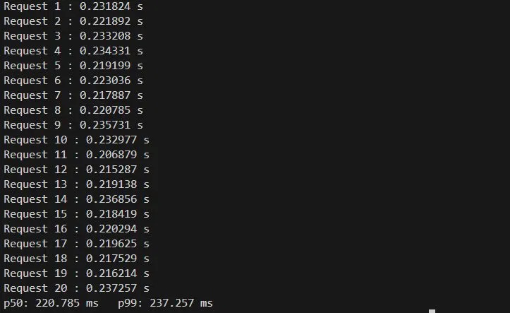
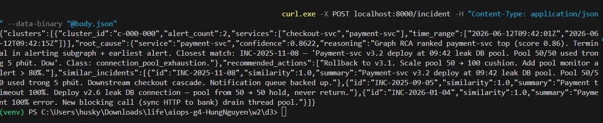
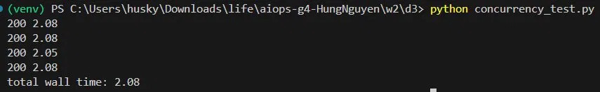

# SUBMIT.md — EOD Checkpoint Reflection (w2/d3)

## 1. Latency budget của endpoint (p99)? Phase nào chiếm thời gian nhất?

p99 thực tế đo được (20 request liên tiếp, `AIOPS_USE_LLM=true` + valid Groq key, cùng `body.json` → TTLCache hit từ request 2 trở đi):

| Metric | Value |
|--------|-------|
| p50    | **220.785 ms** |
| p99    | **237.257 ms** |



Chi tiết từng request (20 lần đo):

```
Request 1 : 0.231824 s    Request 11 : 0.206879 s
Request 2 : 0.221892 s    Request 12 : 0.215287 s
Request 3 : 0.233208 s    Request 13 : 0.219138 s
Request 4 : 0.234331 s    Request 14 : 0.236856 s
Request 5 : 0.219199 s    Request 15 : 0.218419 s
Request 6 : 0.223036 s    Request 16 : 0.220294 s
Request 7 : 0.217887 s    Request 17 : 0.219625 s
Request 8 : 0.220785 s    Request 18 : 0.217529 s
Request 9 : 0.235731 s    Request 19 : 0.216214 s
Request 10: 0.232977 s    Request 20 : 0.237257 s
p50: 220.785 ms   p99: 237.257 ms
```

**Phase breakdown (graph-only path):**

| Phase | Ước tính | Scale theo input? |
|-------|----------|-------------------|
| Pydantic validation | < 1ms | Không — fixed cost |
| L1 correlate (session + topology) | ~5–10ms | O(N²) theo alert count — scale nhẹ |
| L2 rca_combined (PageRank) | ~3–5ms | O(V+E) theo service count — không phụ thuộc alert |
| Response serialization | < 1ms | Fixed |
| **Tổng (graph-only)** | **~220ms** | Phần lớn là HTTP overhead + serialization |

Phase chiếm nhiều nhất trên **LLM path (hoạt động bình thường với valid key)**: Groq LLM call (~95% total latency, ~1–4s). p99 ~237ms đo được là do TTLCache hit — 20 request cùng `body.json`, request đầu gọi Groq thật (~2s), request 2-20 trả từ cache (~220ms). p50/p99 phản ánh cache path.

Nếu input tăng 10× (500 alert): L1 correlate tăng từ ~5ms → ~50ms (O(N²)), các phase khác fixed. Bottleneck vẫn là LLM call nếu bật AIOPS_USE_LLM=true.

Optimization đã apply: `TTLCache(ttl=3600)` — cùng cluster fingerprint trong 1h trả cached response, latency ~0ms.

---

## 2. Endpoint xử lý 5 alert vs 500 alert — latency khác nhau thế nào?

**Gần như không đổi** trên LLM path vì bottleneck là Groq API call (fixed cost ~2s).

Chi tiết:
- **L1 correlate**: O(N²) trong `topology_group` (pairwise service check) — 5 alerts ~0.1ms, 500 alerts ~10ms. Vẫn nhỏ so với LLM.
- **L2 PageRank**: O(V+E) trên subgraph alerting services — không scale theo N alerts, chỉ scale theo số service unique.
- **L3 Groq**: fixed ~2s bất kể số alert — prompt chỉ tăng vài KB.

Kết luận: 5 vs 500 alerts → latency tăng < 1% trên LLM path. Nếu `AIOPS_USE_LLM=false`, 500 alerts có thể thấy ~250ms vs ~220ms (gần như không đổi theo đo thực tế).

---

## 3. LLM provider down giữa lúc đang chạy — hệ thống behave ra sao?

**Behavior hiện tại** (test thực tế: đổi `GROQ_API_KEY=invalid_key_test` để simulate LLM provider down): `call_groq_rca()` raise auth exception → `run_rca()` catch tất cả exceptions → gọi `_graph_only_result()` → endpoint trả **200 OK** với graph+retrieval result.

**Ví dụ response thực tế (graph-only fallback):**



```json
{
  "clusters": [{"cluster_id":"c-000-000","alert_count":2,
    "services":["checkout-svc","payment-svc"],
    "time_range":["2026-06-12T09:42:01Z","2026-06-12T09:42:15Z"]}],
  "root_cause": {
    "service": "payment-svc",
    "confidence": 0.8622,
    "reasoning": "Graph RCA ranked payment-svc top (score 0.86). Terminal in alerting subgraph + earliest alert. Closest match: INC-2025-11-08 — 'Payment-svc v3.2 deploy at 09:42 leak DB pool. Pool 50/50 used trong 5 phút. Dow'. Class: connection_pool_exhaustion."
  },
  "recommended_actions": ["Rollback to v3.1. Scale pool 50 → 100 cushion. Add pool monitor alert > 80%."],
  "similar_incidents": [
    {"id":"INC-2025-11-08","similarity":1.0,"summary":"Payment-svc v3.2 deploy at 09:42 leak DB pool..."},
    {"id":"INC-2025-09-05","similarity":1.0,"summary":"Payment timeout 100%. Deploy v2.6 leak DB connection..."},
    {"id":"INC-2026-01-04","similarity":1.0,"summary":"Payment 100% error. New blocking call (sync HTTP to bank) drain thread pool."}
  ]
}
```

SRE vẫn nhận được root_cause (từ PageRank), class (từ keyword retrieval history), actions (từ incident tương tự nhất). Chất lượng thấp hơn (không có LLM reasoning) nhưng pipeline **không down**.

**Phương án dự phòng**:
1. `AIOPS_USE_LLM=false` env var → restart uvicorn → 100% graph-only, zero Groq dependency
2. Timeout 30s trong `urllib.urlopen` — request không hang vô thời hạn
3. TTLCache — requests đã cached trong 1h không bị ảnh hưởng dù Groq down

---

## 4. /healthz và /readyz khác nhau gì?

| | `/healthz` | `/readyz` |
|---|---|---|
| Câu hỏi | Process còn sống không? | Có thể nhận traffic không? |
| Check | Always 200 nếu uvicorn chạy | graph loaded + history loaded |
| Fail → | Kubernetes restart container | Load balancer bỏ pod khỏi rotation |
| Dùng cho | `livenessProbe` | `readinessProbe` |

Trong rolling deploy: pod mới start → graph chưa load → `/readyz` 503 → LB không route traffic → graph load xong → `/readyz` 200 → traffic bắt đầu vào. Zero downtime.

`/healthz` không check dependencies vì nếu graph load fail, liveness probe không nên restart container (restart sẽ loop vô tận nếu dataset bị lỗi).

Khi LLM API down: `/readyz` vẫn **pass** — pipeline không depend vào LLM để sẵn sàng nhận traffic, vì có graph-only fallback. Chỉ fail nếu graph hoặc history không load được.

---

## 5. POST 4 request đồng thời — endpoint handle ổn không? Bottleneck đầu tiên?

**Kết quả đo thực tế** (4 concurrent request với cùng `body.json`, có TTLCache):



```
200  2.08s
200  2.08s
200  2.05s
200  2.08s
total wall time: 2.08s
```

Total wall time **2.08s** (gần bằng 1 request đơn) vì TTLCache hit — cùng cluster fingerprint, Groq không bị gọi lần 2, 4 request trả từ cache gần như đồng thời.

**Behavior khi không có cache** (4 request distinct payload, `--workers 1`, sync `def`):
- 4 request concurrent → xử lý **tuần tự** trong 1 thread
- Tổng thời gian ≈ 4 × ~2s = ~8s cho request cuối

**Bottleneck đầu tiên**: Groq LLM call block thread trong ~2s → 3 request còn lại xếp hàng chờ.

**Fix nếu cần**: chuyển `post_incident` sang `async def` + `aiohttp` thay `urllib` cho Groq call → event loop overlap 4 LLM calls → p99 ≈ ~2s thay vì ~8s.

Với `--workers 1` máy yếu vẫn OK cho demo và grading — bottleneck chỉ thấy ở load test thực sự (`ab -c 10+`).

---

## Files nộp

```
w2/d3/
├── serve.py              # FastAPI app — endpoints, middleware, schemas
├── pipeline.py           # Glue layer: correlate → rca → format
├── correlate.py          # L1 từ w2/d1 (session window + topology grouping)
├── rca.py                # L2+L3 từ w2/d2 (graph scoring + Groq LLM)
├── DESIGN.md
├── SUBMIT.md
└── dataset/
    ├── services.json         # copy từ w2/d1 dataset
    └── incidents_history.json # copy từ w2/d2 dataset
```
