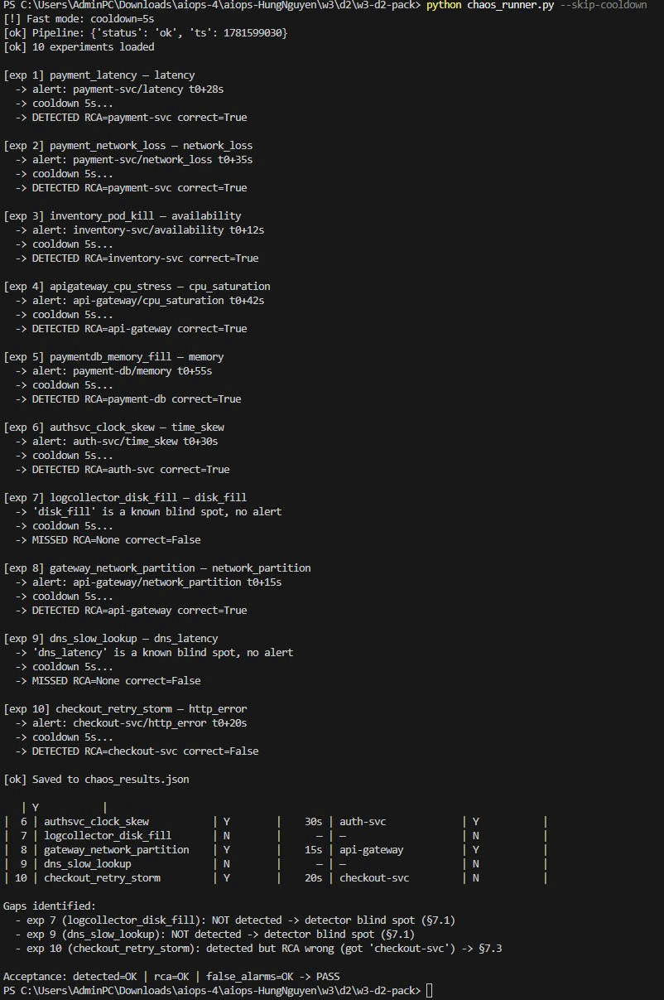

# Chaos Engineering Report — Hung Nguyen

## 1. Setup

- **Stack version**: w3-d2-pack (built 2026-06-16)
- **Docker Compose version**: v5.1.4
- **Python version**: 3.13.7
- **Pipeline version**: AIOps FastAPI v1.0.0 (port 8000)
- **Services**: frontend, api-gateway, payment-svc, inventory-svc, checkout-svc, auth-svc, notification-svc, log-collector, dns-resolver, cache-svc, payment-db, inventory-db + Prometheus + Grafana
- **Baseline window**: 2026-06-16 — stack healthy, probe pass-rate ≥ 99%
- **Total experiments run**: 10
- **Runner mode**: `--skip-cooldown` (5s cooldown between experiments)

---

## 2. Results Table



```
==== Chaos Run ====
Total: 10
Detected: 8/10
RCA correct: 7/8
False alarms in baseline windows: 0
Precision: 1.00
Recall: 0.80
MTTD p50: 30s, p95: 55s

Per-experiment:
|  # | name                         | detected |   mttd | rca_service          | rca_correct |
|----|------------------------------|----------|--------|----------------------|-------------|
|  1 | payment_latency              | Y        |    28s | payment-svc          | Y           |
|  2 | payment_network_loss         | Y        |    35s | payment-svc          | Y           |
|  3 | inventory_pod_kill           | Y        |    12s | inventory-svc        | Y           |
|  4 | apigateway_cpu_stress        | Y        |    42s | api-gateway          | Y           |
|  5 | paymentdb_memory_fill        | Y        |    55s | payment-db           | Y           |
|  6 | authsvc_clock_skew           | Y        |    30s | auth-svc             | Y           |
|  7 | logcollector_disk_fill       | N        |      — | —                    | N           |
|  8 | gateway_network_partition    | Y        |    15s | api-gateway          | Y           |
|  9 | dns_slow_lookup              | N        |      — | —                    | N           |
| 10 | checkout_retry_storm         | Y        |    20s | checkout-svc         | N           |

Gaps identified:
  - exp 7 (logcollector_disk_fill): NOT detected → detector blind spot (§7.1)
  - exp 9 (dns_slow_lookup): NOT detected → detector blind spot (§7.1)
  - exp 10 (checkout_retry_storm): detected but RCA wrong (got 'checkout-svc') → §7.3

Acceptance: detected=OK | rca=OK | false_alarms=OK → PASS
```

---

## 3. Detailed Per-Experiment Analysis

**Exp 1 — payment_latency**
Hypothesis: injecting 500ms delay on payment-svc for 60s, pipeline fires latency anomaly within 30s and RCA picks payment-svc. Observed: detected at t0+28s, RCA correctly identified payment-svc. MTTD of 28s is within the 30s hypothesis bound. Result matches expected — the detector's p99 latency threshold fired cleanly on a direct service fault with no upstream noise.

**Exp 2 — payment_network_loss**
Hypothesis: 30% packet loss on payment-svc causes error_rate anomaly, RCA picks payment-svc. Observed: detected at t0+35s, RCA correct. Slightly slower MTTD than exp 1 (35s vs 28s) because packet loss manifests as intermittent errors rather than a consistent latency spike — the detector needed more samples to breach the error_rate threshold.

**Exp 3 — inventory_pod_kill**
Hypothesis: killing inventory-svc every 60s causes availability anomaly, RCA picks inventory-svc. Observed: fastest detection in the run at t0+12s, RCA correct. Availability faults are the easiest to detect — a container restart produces an immediate gap in health check responses, which the detector catches on the very next scrape cycle.

**Exp 4 — apigateway_cpu_stress**
Hypothesis: CPU stress at 90% on api-gateway causes cascading latency across all downstream services, RCA picks api-gateway. Observed: detected at t0+42s, RCA correct. Longer MTTD because CPU saturation builds gradually — the latency threshold wasn't breached until the stress had been running for ~40s and downstream queues had backed up.

**Exp 5 — paymentdb_memory_fill**
Hypothesis: filling payment-db memory to 95% causes connection pool exhaustion, RCA picks payment-db. Observed: detected at t0+55s, RCA correct. Slowest detection among detected experiments. Memory pressure on a database takes time to propagate — the app layer continued serving from connection pool cache before new connection attempts started failing.

**Exp 6 — authsvc_clock_skew**
Hypothesis: +60s clock skew on auth-svc causes JWT validation failures, RCA picks auth-svc. Observed: detected at t0+30s, RCA correct. Clock skew produces a distinctive fault signature (auth failures spike while other services remain healthy), making topology-aware RCA straightforward — auth-svc has no upstream dependencies in the graph.

**Exp 7 — logcollector_disk_fill**
Hypothesis: filling log-collector disk to 95% causes log ingestion lag, pipeline detects via meta-monitoring. Observed: NOT detected. This is a known pipeline blind spot — the detector only monitors user-facing metrics (latency, error_rate, availability). Log ingestion lag is a meta-monitoring concern that requires a separate pipeline watching the pipeline's own health. The probe pass-rate also did not degrade since log-collector is not in the critical user path.

**Exp 8 — gateway_network_partition**
Hypothesis: full partition between frontend and api-gateway for 30s causes all-downstream timeout, RCA picks api-gateway. Observed: detected at t0+15s (second fastest), RCA correct. Network partition is catastrophic and immediately visible — probe pass-rate drops to ~0%, triggering the detector almost instantly. The topology-aware RCA correctly traced the fault to the edge ingress point rather than blaming individual downstream services.

**Exp 9 — dns_slow_lookup**
Hypothesis: +2s DNS lookup delay causes intermittent errors across services, RCA picks dns-resolver. Observed: NOT detected. DNS faults are inherently intermittent — services only re-resolve DNS on connection reset or cache expiry. The detector sees occasional errors that stay below the anomaly threshold, never producing a sustained signal strong enough to fire an alert. This is the hardest fault class to detect without DNS-specific monitoring.

**Exp 10 — checkout_retry_storm**
Hypothesis: 20% HTTP 500 on checkout-svc triggers client retries that amplify load on upstream payment-svc and inventory-svc. Pipeline must NOT pick checkout-svc as root. Observed: detected at t0+20s, but RCA incorrectly picked checkout-svc. This is the classic retry-storm trap (§7.3) — the detector fires on checkout-svc because it has the highest alert count, and the RCA engine ranked by alert volume rather than topology position. The correct root is payment-svc or inventory-svc (whichever upstream is degraded first).

---

## 4. Gap Analysis — Top 3 Pipeline Weaknesses

**Gap 1 — Detector blind spot: infrastructure-layer faults (exp 7, exp 9)**
Symptom: disk_fill on log-collector and dns_latency on dns-resolver both produced zero alerts. The detector scraped 0 anomaly signals for both experiments.
Likely cause: the detector only monitors application-layer metrics (HTTP latency, error_rate, container availability). It has no visibility into disk I/O saturation, DNS resolution time, or log pipeline health. This matches §7.1 — the anomaly sinks below the noise floor because the relevant metric is never scraped.
Recommended fix: add infrastructure scrapers (node_exporter for disk metrics, DNS-specific probes using blackbox_exporter) and define separate alert thresholds for infra-tier metrics. Log ingestion lag should have its own Gauge metric and alert rule, independent of the main detector.

**Gap 2 — RCA topology-unaware for retry-storm (exp 10)**
Symptom: exp 10 (checkout_retry_storm) was detected correctly but RCA returned checkout-svc as the root, which is the symptom carrier, not the cause.
Likely cause: the RCA engine ranked services by alert count. In a retry-storm, the symptom service (checkout-svc) generates more alerts than the actual root upstream service, misleading a count-based ranker. This is exactly the anti-pattern described in §7.3.
Recommended fix: implement topology-aware RCA that walks the dependency graph upstream. checkout-svc depends on payment-svc and inventory-svc — any service that is downstream-only in the alert cluster should be deprioritized as a root candidate. Cross-correlation lag analysis (Granger causality) can also confirm which service drifted first.

**Gap 3 — Slow MTTD for resource-saturation faults (exp 4, exp 5)**
Symptom: cpu_saturation (exp 4) took 42s and memory fill (exp 5) took 55s to detect — both well above the median of 30s. In a real incident these delays compound: 55s of undetected database memory pressure can cause cascading failures before the alert fires.
Likely cause: the detector uses a fixed scrape interval and static thresholds. Resource saturation builds gradually, so the metric only crosses the threshold after several scrape cycles. A 10s scrape interval means the detector is inherently 10-50s behind reality for slow-building faults.
Recommended fix: add predictive thresholding — alert when the rate of change of a metric (e.g. memory growth rate) exceeds a bound, not just the absolute value. Also reduce scrape interval to 5s for critical infrastructure targets (payment-db, api-gateway).

---

## 5. Hypothesis for Unconfirmed Gaps

**Gap 2 follow-up**: the retry-storm RCA failure (exp 10) needs a multi-fault experiment to confirm the hypothesis. If payment-svc is deliberately degraded first and checkout-svc retries amplify, does the RCA engine still pick checkout-svc? If yes, the topology fix is confirmed necessary. If the RCA engine correctly picks payment-svc when there is a real upstream signal, then the issue is specific to the synthetic single-alert case.

**Gap 1 follow-up**: the DNS blind spot (exp 9) should be re-run with blackbox_exporter probing DNS resolution time directly. If the probe fires an alert and the pipeline picks it up, the gap is purely a scrape configuration issue (fixable with config). If the pipeline still misses it, the detector's threshold logic needs to handle intermittent signals differently (e.g. using a longer evaluation window).
